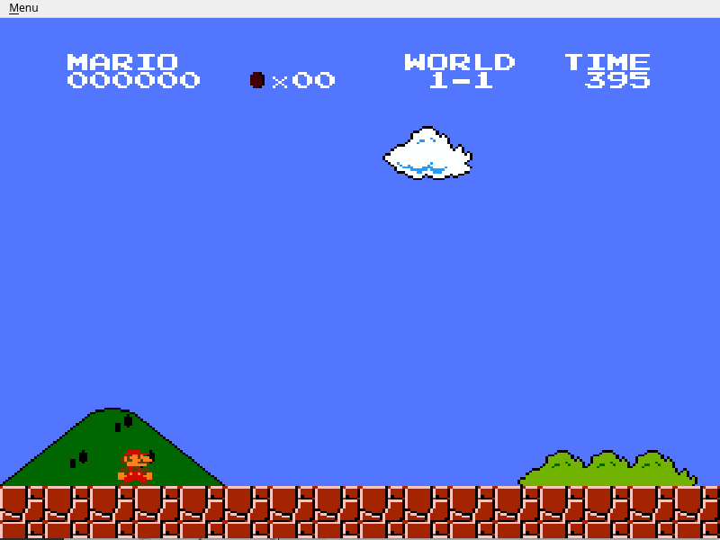
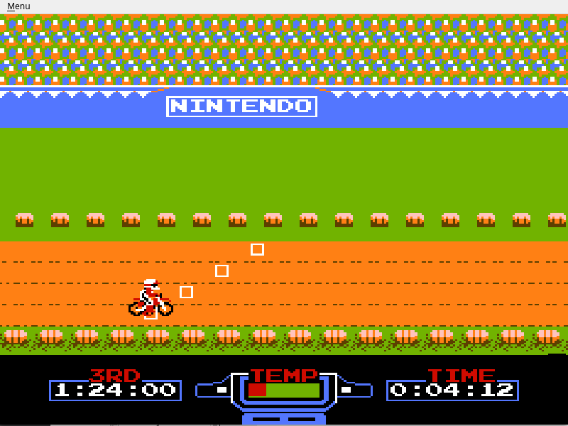
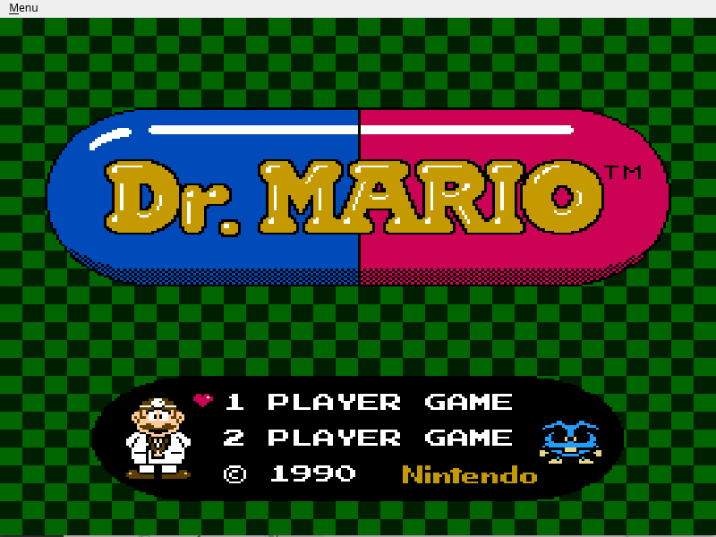

# HaniwaNES
HaniwaNES is a cycle-accurate NES/Famicom emulator with GUI written in SDL2 + Qt.

## Requirements
- c++17;
- SDL2;
- Qt;

## Demo

## Already done
- CPU;
- PPU;
- INES format reading;
- Mapper0(NROM), Mapper1(MMC1);
- Standard controllers;
- Basic(VERY BASIC) GUI;
- Save/load game progress;
- Pause/stop emulation.

## Still needs to be done
- APU;
- Mappers >= 2;
- More advanced GUI;
- Bug fixing, optimization;
- ...
- More bug fixing.

## For now, you can run such games as
- Super Mario Bros;
- Donkey Kong(s);
- Excitebike;
- Ice Climber;
- Bomberman;
- Battletoads;
- Dr. Mario;
- Battle City;
- Chip'n'Dale Rescue Rangers
- ... and much more

